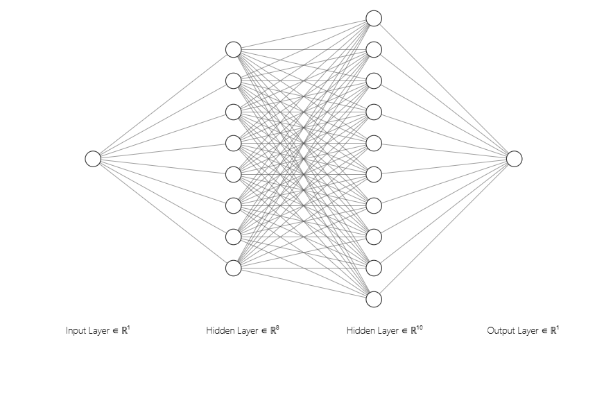
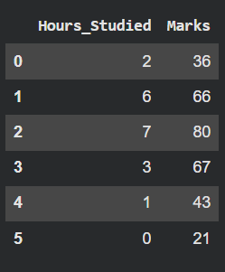
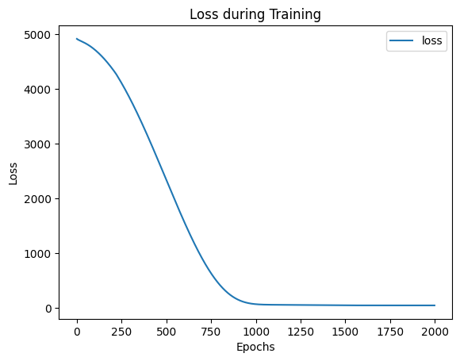
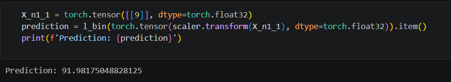

# Developing a Neural Network Regression Model

## AIM
To develop a neural network regression model for the given dataset.

## THEORY
Regression is a supervised learning technique used to predict continuous numerical values based on input data. In this problem, the goal is to develop a neural network model that learns the relationship between a numeric input and a numeric output from a dataset, and then uses this learned relationship to make predictions on new data.
A neural network regression model consists of an input layer, one or more hidden layers, and an output layer. The input is processed through the network using weighted connections and activation functions like ReLU, and the final output layer produces a continuous value using a linear activation function. The model learns by adjusting its weights to minimize the difference between predicted and actual values.
Before training, the data is normalized using techniques like Min-Max Scaling to improve performance. The model is trained using a loss function such as Mean Squared Error (MSE) and an optimizer like Adam. After training, the model is evaluated using test data, and its performance can be visualized using plots like the loss curve.

## Neural Network Model

## DESIGN STEPS
### STEP 1: 

Create your dataset in a Google sheet with one numeric input and one numeric output.

### STEP 2: 

Split the dataset into training and testing

### STEP 3: 

Create MinMaxScalar objects ,fit the model and transform the data.

### STEP 4: 

Build the Neural Network Model and compile the model.

### STEP 5: 

Train the model with the training data.

### STEP 6: 

Plot the performance plot

### STEP 7: 

Evaluate the model with the testing data.

### STEP 8: 

Use the trained model to predict  for a new input value .

## PROGRAM

### Name: Krishna Prasad S

### Register Number: 212223230108

```python
class NeuralNet(nn.Module):
  def __init__(self):
        super().__init__()
        self.fc1 = nn.Linear(1,8)
        self.fc2 = nn.Linear(8,10)
        self.fc3 = nn.Linear(10,1)
        self.relu = nn.ReLU()
        self.history = {'loss': []}
  def forward(self, x):
        x = self.relu(self.fc1(x))
        x = self.relu(self.fc2(x))
        x = self.fc3(x)
        return x


# Initialize the Model, Loss Function, and Optimizer

l_bin = NeuralNet()
criterion = nn.MSELoss()
optimizer = optim.RMSprop(l_bin.parameters(), lr=0.001)

```

### Dataset Information


### OUTPUT

### Training Loss Vs Iteration Plot


### New Sample Data Prediction


## RESULT
Thus, a neural network regression model was successfully developed and trained using PyTorch.
